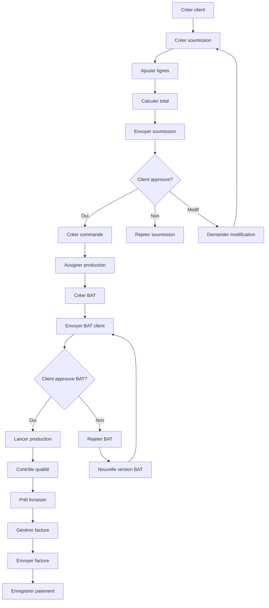
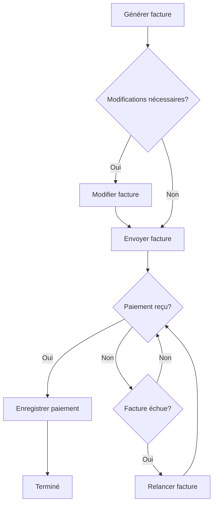
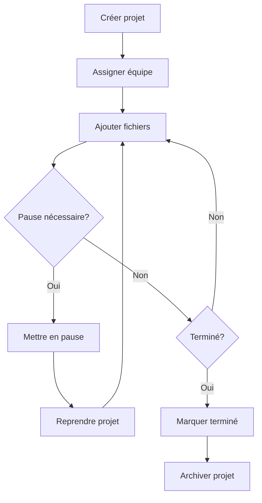

# Inventaire des actions - PromoFlow

## 1. Actions par domaine métier

### 1.1 Gestion clients

| ID  | Action                  | Rôle initiateur              | Préconditions      | Postconditions                         | Fonctions appelées |
| --- | ----------------------- | ---------------------------- | ------------------ | -------------------------------------- | ------------------ |
| A01 | Créer client            | employee, manager            | email valide       | client créé                            | -                  |
| A02 | Modifier client         | employee, manager            | client existe      | client mis à jour                      | -                  |
| A03 | Archiver client         | manager, admin               | client inactif     | client archivé                         | -                  |
| A04 | Assigner commercial     | manager                      | client + employé   | assignation créée                      | -                  |
| A05 | Consulter historique    | employee, manager            | accès client       | historique affiché                     | -                  |

### 1.2 Workflow soumissions

| ID  | Action                  | Rôle initiateur              | Préconditions      | Postconditions                         | Fonctions appelées |
| --- | ----------------------- | ---------------------------- | ------------------ | -------------------------------------- | ------------------ |
| A06 | Créer soumission        | employee                     | client existe      | soumission DRAFT                       | -                  |
| A07 | Ajouter ligne produit   | employee                     | soumission DRAFT   | ligne ajoutée                          | -                  |
| A08 | Calculer total          | system                       | lignes présentes   | totaux calculés                        | -                  |
| A09 | Envoyer soumission      | employee                     | DRAFT complet      | status PENDING, email envoyé           | E01                |
| A10 | Approuver soumission    | client via portail           | token valide       | status APPROVED                        | E02                |
| A11 | Rejeter soumission      | client via portail           | token valide       | status REJECTED                        | E03                |
| A12 | Demander modification   | client via portail           | token valide       | status MODIFICATION_REQUESTED          | E03                |

### 1.3 Production et épreuves

| ID  | Action                  | Rôle initiateur              | Préconditions      | Postconditions                         | Fonctions appelées |
| --- | ----------------------- | ---------------------------- | ------------------ | -------------------------------------- | ------------------ |
| A13 | Créer commande          | system                       | soumission approved| commande créée                         | -                  |
| A14 | Assigner production     | production manager           | commande validée   | équipe assignée                        | E04                |
| A15 | Créer BAT               | production                   | fichiers prêts     | proof v1 PENDING                       | -                  |
| A16 | Envoyer BAT client      | production                   | BAT prêt           | BAT envoyé, email client               | send-proof-to-client |
| A17 | Approuver BAT           | client                       | token valide       | proof APPROVED                         | E12                |
| A18 | Rejeter BAT             | client                       | token valide       | proof REJECTED                         | E12                |
| A19 | Nouvelle version BAT    | production                   | corrections faites | proof v+1 créé                         | -                  |
| A20 | Lancer production       | production                   | BAT approuvé       | statut IN_PRODUCTION                   | E04                |
| A21 | Contrôle qualité        | production                   | production finie   | statut QUALITY_CHECK                   | -                  |
| A22 | Marquer prêt livraison  | production                   | qualité OK         | statut READY_FOR_DELIVERY              | -                  |

### 1.4 Facturation et paiements

| ID  | Action                  | Rôle initiateur              | Préconditions      | Postconditions                         | Fonctions appelées |
| --- | ----------------------- | ---------------------------- | ------------------ | -------------------------------------- | ------------------ |
| A23 | Générer facture         | system sur event commande    | commande livrable  | invoice DRAFT                          | E07                |
| A24 | Modifier facture        | comptabilité                 | facture DRAFT      | facture modifiée                       | -                  |
| A25 | Envoyer facture         | comptabilité                 | facture DRAFT/SENT | facture SENT, email envoyé             | E08                |
| A26 | Enregistrer paiement    | comptabilité, Stripe webhook | facture ouverte    | paiement enregistré, statut mis à jour | E06 ou E09         |
| A27 | Relancer facture        | comptabilité                 | facture overdue    | rappel envoyé                          | E08                |
| A28 | Annuler facture         | comptabilité                 | facture non payée  | facture VOID                           | -                  |

### 1.5 Projets et dossiers

| ID  | Action                  | Rôle initiateur              | Préconditions      | Postconditions                         | Fonctions appelées |
| --- | ----------------------- | ---------------------------- | ------------------ | -------------------------------------- | ------------------ |
| A29 | Créer projet dossier    | employee, manager            | client existe      | projet OPEN                            | -                  |
| A30 | Assigner équipe         | manager                      | projet ouvert      | membres assignés                       | -                  |
| A31 | Ajouter fichier         | membre équipe                | accès projet       | fichier uploadé                        | -                  |
| A32 | Mettre en pause         | manager                      | projet actif       | statut PAUSED                          | -                  |
| A33 | Reprendre projet        | manager                      | projet pausé       | statut OPEN                            | -                  |
| A34 | Marquer terminé         | manager                      | livrables finis    | statut COMPLETED                       | -                  |
| A35 | Archiver projet         | manager                      | projet terminé     | statut ARCHIVED                        | -                  |

### 1.6 Ressources humaines

| ID  | Action                  | Rôle initiateur              | Préconditions      | Postconditions                         | Fonctions appelées |
| --- | ----------------------- | ---------------------------- | ------------------ | -------------------------------------- | ------------------ |
| A36 | Demande de congé        | employee                     | dates cohérentes   | requête SUBMITTED                      | -                  |
| A37 | Approuver congé         | manager, HR                  | requête SUBMITTED  | APPROVED                               | -                  |
| A38 | Rejeter congé           | manager, HR                  | requête SUBMITTED  | REJECTED                               | -                  |
| A39 | Annuler congé           | employee                     | requête APPROVED   | CANCELLED                              | -                  |
| A40 | Saisir temps            | employee                     | projet actif       | timesheet ligne créée                  | -                  |
| A41 | Valider feuille temps   | manager                      | semaine complète   | timesheet validée                      | -                  |
| A42 | Exporter temps          | HR, comptabilité             | période définie    | rapport généré                         | -                  |

### 1.7 Administration système

| ID  | Action                  | Rôle initiateur              | Préconditions      | Postconditions                         | Fonctions appelées |
| --- | ----------------------- | ---------------------------- | ------------------ | -------------------------------------- | ------------------ |
| A43 | Créer utilisateur       | admin                        | email valide       | profil créé                            | -                  |
| A44 | Modifier rôle           | admin                        | utilisateur existe | rôle mis à jour                        | -                  |
| A45 | Désactiver utilisateur  | admin                        | utilisateur actif  | compte désactivé                       | -                  |
| A46 | Réinitialiser mot passe | admin, user                  | compte valide      | email reset envoyé                     | -                  |
| A47 | Consulter logs          | admin                        | accès admin        | logs affichés                          | -                  |
| A48 | Configurer système      | admin                        | paramètres valides | configuration mise à jour              | -                  |

## 2. Matrice Actions ↔ Fonctions

| Action / Fonction                      | E01 | E02 | E03 | E04 | E05 | E06 | E07 | E08 | E09 | E10 | E11 | E12 |
| -------------------------------------- | --- | --- | --- | --- | --- | --- | --- | --- | --- | --- | --- | --- |
| A09 Envoyer soumission                 | ✅   |     |     |     |     |     |     |     |     |     |     |     |
| A10 Approuver soumission               |     | ✅   |     |     |     |     |     |     |     |     |     |     |
| A11 Rejeter soumission                 |     |     | ✅   |     |     |     |     |     |     |     |     |     |
| A12 Demander modification              |     |     | ✅   |     |     |     |     |     |     |     |     |     |
| A14 Assigner production                |     |     |     | ✅   |     |     |     |     |     |     |     |     |
| A17 Approuver BAT                      |     |     |     |     |     |     |     |     |     |     |     | ✅   |
| A18 Rejeter BAT                        |     |     |     |     |     |     |     |     |     |     |     | ✅   |
| A20 Lancer production                  |     |     |     | ✅   |     |     |     |     |     |     |     |     |
| A23 Générer facture                    |     |     |     |     |     |     | ✅   |     |     |     |     |     |
| A25 Envoyer facture                    |     |     |     |     |     |     |     | ✅   |     |     |     |     |
| A26 Enregistrer paiement               |     |     |     |     |     | ✅   |     |     | ✅   |     |     |     |
| A27 Relancer facture                   |     |     |     |     |     |     |     | ✅   |     |     |     |     |

## 3. Workflows d'actions

### 3.1 Workflow principal: Devis → Livraison

### 3.2 Workflow facturation

### 3.3 Workflow projet

## 4. Règles métier et validations

### 4.1 Contraintes d'actions

| Action | Contraintes de rôle | Contraintes de statut | Contraintes de données |
| ------ | ------------------- | -------------------- | ---------------------- |
| A01    | employee+           | -                    | email unique           |
| A09    | employee+           | soumission DRAFT     | total > 0              |
| A10    | client              | soumission PENDING   | token valide           |
| A15    | production          | commande validée     | fichiers uploadés      |
| A17    | client              | proof PENDING        | token non expiré       |
| A23    | system              | commande DELIVERED   | pas de facture existante |
| A26    | comptabilité+       | facture ouverte      | montant cohérent       |

### 4.2 Transitions d'état autorisées

| Entité | État initial | Action | État final | Conditions |
| ------ | ------------ | ------ | ---------- | ---------- |
| Soumission | DRAFT | A09 | PENDING | Lignes présentes |
| Soumission | PENDING | A10 | APPROVED | Token valide |
| Soumission | PENDING | A11 | REJECTED | Token valide |
| Commande | NEW | A14 | IN_PRODUCTION | Équipe assignée |
| Proof | PENDING | A17 | APPROVED | Client valide |
| Proof | REJECTED | A19 | PENDING v+1 | Corrections faites |
| Facture | DRAFT | A25 | SENT | Contenu valide |
| Facture | SENT | A26 | PAID/PARTIAL | Paiement reçu |

### 4.3 Événements déclencheurs

| Événement | Actions automatiques | Délai | Conditions |
| --------- | -------------------- | ----- | ---------- |
| Soumission créée | - | - | - |
| Soumission envoyée | Email client | Immédiat | Email valide |
| Soumission approuvée | Créer commande | Immédiat | - |
| BAT approuvé | Lancer production | Immédiat | - |
| Commande livrée | Générer facture | 1 jour | Configuration auto |
| Facture échue | Relance client | J+7, J+15, J+30 | Solde > 0 |
| Paiement reçu | Mise à jour statuts | Immédiat | Montant validé |

## 5. Métriques et KPI d'actions

### 5.1 Volumes d'actions (mensuel)

| Action | Volume moyen | Volume pic | Tendance |
| ------ | ------------ | ---------- | -------- |
| A06 Créer soumission | 150 | 300 | ↗️ +15% |
| A09 Envoyer soumission | 120 | 250 | ↗️ +12% |
| A10 Approuver soumission | 72 | 150 | ↗️ +8% |
| A15 Créer BAT | 65 | 130 | ↗️ +5% |
| A17 Approuver BAT | 58 | 115 | ↗️ +3% |
| A23 Générer facture | 55 | 110 | ↗️ +2% |

### 5.2 Temps d'exécution moyens

| Action | Temps utilisateur | Temps système | SLA |
| ------ | ----------------- | ------------- | --- |
| A06 Créer soumission | 25 min | 2 sec | 30 min |
| A15 Créer BAT | 45 min | 5 sec | 60 min |
| A09 Envoyer soumission | 2 min | 15 sec | 5 min |
| A23 Générer facture | Auto | 3 sec | 10 sec |

### 5.3 Taux de succès

| Action | Taux succès | Causes d'échec principales |
| ------ | ----------- | -------------------------- |
| A09 Envoyer soumission | 98.5% | Email invalide, Resend down |
| A10 Approuver soumission | 95% | Token expiré |
| A17 Approuver BAT | 92% | Fichier corrompu |
| A26 Enregistrer paiement | 99.2% | Webhook Stripe |