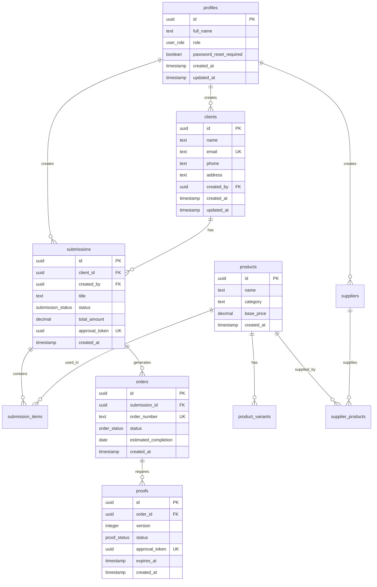

# Diagramme Entité-Relation - PromoFlow

## Vue d'ensemble de l'architecture de données

Cette documentation présente le modèle de données complet de l'application PromoFlow, incluant les relations entre entités, les contraintes et les règles métier.

## Entités principales

### 1. Gestion des utilisateurs

#### `profiles`
- **Clé primaire**: `id` (UUID, FK vers auth.users)
- **Attributs**:
  - `full_name` (TEXT) - Nom complet
  - `role` (user_role ENUM) - Rôle utilisateur
  - `password_reset_required` (BOOLEAN) - Force changement mot de passe
  - `created_at`, `updated_at` (TIMESTAMP)

**Relations**:
- 1:N vers `submissions` (soumissions créées)
- 1:N vers `clients` (via `created_by`)
- 1:N vers `suppliers` (via `created_by`)

#### `user_role` (ENUM)
- `admin` - Administrateur système
- `manager` - Gestionnaire
- `employee` - Employé
- `client` - Client externe

### 2. Gestion commerciale

#### `clients`
- **Clé primaire**: `id` (UUID)
- **Attributs**:
  - `name` (TEXT NOT NULL) - Nom client
  - `email` (TEXT UNIQUE) - Email contact
  - `phone` (TEXT) - Téléphone
  - `address` (TEXT) - Adresse
  - `notes` (TEXT) - Notes internes
  - `created_by` (UUID, FK profiles)
  - `created_at`, `updated_at` (TIMESTAMP)

**Relations**:
- 1:N vers `submissions`
- N:1 vers `profiles` (créateur)

#### `suppliers`
- **Clé primaire**: `id` (UUID)
- **Attributs**:
  - `name` (TEXT NOT NULL) - Nom fournisseur
  - `email` (TEXT) - Email contact
  - `phone` (TEXT) - Téléphone
  - `address` (TEXT) - Adresse
  - `specialties` (TEXT[]) - Spécialités
  - `contact_person` (TEXT) - Personne contact
  - `notes` (TEXT) - Notes internes
  - `created_by` (UUID, FK profiles)

**Relations**:
- N:M vers `products` (via `supplier_products`)
- N:1 vers `profiles` (créateur)

### 3. Catalogue produits

#### `products`
- **Clé primaire**: `id` (UUID)
- **Attributs**:
  - `name` (TEXT NOT NULL) - Nom produit
  - `description` (TEXT) - Description
  - `category` (TEXT) - Catégorie
  - `base_price` (DECIMAL) - Prix de base
  - `created_at`, `updated_at` (TIMESTAMP)

**Relations**:
- 1:N vers `product_variants`
- 1:N vers `submission_items`
- N:M vers `suppliers` (via `supplier_products`)

#### `product_variants`
- **Clé primaire**: `id` (UUID)
- **Attributs**:
  - `product_id` (UUID, FK products)
  - `name` (TEXT NOT NULL) - Nom variant
  - `specifications` (JSONB) - Spécifications techniques
  - `price_modifier` (DECIMAL) - Modificateur prix
  - `is_active` (BOOLEAN DEFAULT true)

#### `supplier_products`
- **Clé composite**: (`supplier_id`, `product_id`)
- **Attributs**:
  - `supplier_id` (UUID, FK suppliers)
  - `product_id` (UUID, FK products)
  - `supplier_price` (DECIMAL) - Prix fournisseur
  - `minimum_quantity` (INTEGER) - Quantité minimum
  - `lead_time_days` (INTEGER) - Délai livraison

### 4. Workflow de production

#### `submissions`
- **Clé primaire**: `id` (UUID)
- **Attributs**:
  - `client_id` (UUID, FK clients)
  - `created_by` (UUID, FK profiles)
  - `title` (TEXT NOT NULL) - Titre soumission
  - `description` (TEXT) - Description
  - `status` (submission_status ENUM)
  - `priority` (priority_level ENUM)
  - `expected_delivery` (DATE) - Livraison attendue
  - `total_amount` (DECIMAL) - Montant total
  - `approval_token` (UUID UNIQUE) - Token validation client
  - `created_at`, `updated_at` (TIMESTAMP)

**Relations**:
- N:1 vers `clients`
- N:1 vers `profiles` (créateur)
- 1:N vers `submission_items`
- 1:N vers `orders` (si acceptées)
- 1:N vers `proofs`

#### `submission_status` (ENUM)
- `draft` - Brouillon
- `pending` - En attente validation
- `approved` - Approuvée
- `rejected` - Rejetée
- `in_production` - En production
- `completed` - Terminée

#### `submission_items`
- **Clé primaire**: `id` (UUID)
- **Attributs**:
  - `submission_id` (UUID, FK submissions)
  - `product_id` (UUID, FK products)
  - `product_variant_id` (UUID, FK product_variants, NULLABLE)
  - `quantity` (INTEGER NOT NULL)
  - `unit_price` (DECIMAL NOT NULL)
  - `total_price` (DECIMAL NOT NULL)
  - `specifications` (JSONB) - Specs spécifiques

### 5. Gestion des commandes

#### `orders`
- **Clé primaire**: `id` (UUID)
- **Attributs**:
  - `submission_id` (UUID, FK submissions)
  - `order_number` (TEXT UNIQUE) - Numéro commande
  - `status` (order_status ENUM)
  - `production_notes` (TEXT) - Notes production
  - `estimated_completion` (DATE)
  - `actual_completion` (DATE, NULLABLE)
  - `created_at`, `updated_at` (TIMESTAMP)

#### `order_status` (ENUM)
- `pending` - En attente
- `in_production` - En production
- `quality_check` - Contrôle qualité
- `ready_for_delivery` - Prêt livraison
- `delivered` - Livré
- `cancelled` - Annulé

### 6. Système de validation (BAT)

#### `proofs`
- **Clé primaire**: `id` (UUID)
- **Attributs**:
  - `order_id` (UUID, FK orders)
  - `version` (INTEGER) - Version BAT
  - `file_url` (TEXT) - URL fichier BAT
  - `status` (proof_status ENUM)
  - `client_comments` (TEXT) - Commentaires client
  - `internal_notes` (TEXT) - Notes internes
  - `approval_token` (UUID UNIQUE) - Token validation
  - `expires_at` (TIMESTAMP) - Expiration
  - `approved_at` (TIMESTAMP, NULLABLE)
  - `created_at` (TIMESTAMP)

#### `proof_status` (ENUM)
- `pending` - En attente validation
- `approved` - Approuvé
- `rejected` - Rejeté
- `expired` - Expiré

## Vues métier

### `v_ordre_historique`
Vue consolidée pour l'historique des commandes avec jointures optimisées.

### `v_submission_details`
Vue détaillée des soumissions avec calculs automatiques.

## Contraintes et règles métier

### Contraintes d'intégrité
1. **Référentiel**: Toutes les FK sont contraintes avec CASCADE appropriés
2. **Unicité**: Emails clients, tokens d'approbation
3. **Validation**: Formats email, numéros de téléphone
4. **Temporelle**: `expires_at > created_at` pour les BATs

### Triggers automatiques
1. **Timestamps**: Auto-update des `updated_at`
2. **Historique**: Journalisation des changements critiques
3. **Calculs**: Auto-calcul des totaux sur `submission_items`
4. **Notifications**: Déclenchement emails sur changements statut

### RLS (Row Level Security)
- **profiles**: Accès selon rôle utilisateur
- **clients**: Visibilité selon créateur/assignation
- **submissions**: Accès selon rôle et propriété
- **orders**: Restriction selon permissions production
- **proofs**: Accès public via token, privé selon rôle

## Index de performance

### Index principaux
```sql
-- Index de recherche
CREATE INDEX idx_clients_name ON clients USING gin(to_tsvector('french', name));
CREATE INDEX idx_products_category ON products(category);

-- Index de jointure
CREATE INDEX idx_submissions_client_status ON submissions(client_id, status);
CREATE INDEX idx_orders_status_completion ON orders(status, estimated_completion);

-- Index temporels
CREATE INDEX idx_proofs_expires_at ON proofs(expires_at) WHERE status = 'pending';
CREATE INDEX idx_submissions_created_at ON submissions(created_at DESC);
```

## Diagramme relationnel



## Évolution prévue

### Version 2.0 (prochaines itérations)
- Table `invoices` pour facturation
- Table `payments` pour suivi paiements
- Table `delivery_tracking` pour logistique
- Système de notifications push
- Intégration ERP/comptabilité

### Optimisations futures
- Partitioning des tables historiques
- Archivage automatique des anciennes données
- Réplication read-only pour analytics
- Cache Redis pour requêtes fréquentes