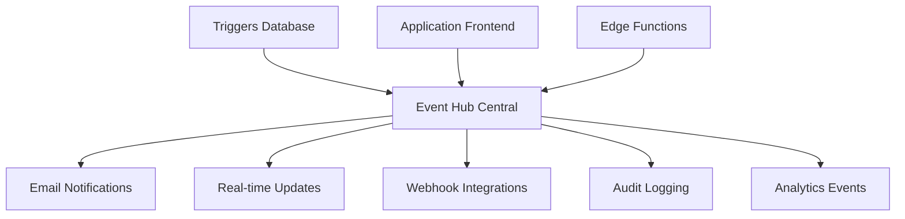

# Système d'événements et notifications - PromoFlow

## Vue d'ensemble

Le système d'événements de PromoFlow orchestre toutes les communications automatiques, les notifications temps réel et les intégrations entre les différents modules de l'application. Il assure une expérience utilisateur fluide et un suivi complet des processus métier.

## 1. Architecture du système d'événements

### 1.1 Hub central d'événements



### 1.2 Types d'événements

#### Événements métier
- `submission.created` - Nouveau devis créé
- `submission.approved` - Devis approuvé par client  
- `submission.rejected` - Devis rejeté
- `order.created` - Commande générée
- `proof.uploaded` - BAT téléchargé
- `proof.approved` - BAT validé
- `order.completed` - Commande terminée

#### Événements système
- `user.login` - Connexion utilisateur
- `user.created` - Nouvel utilisateur
- `system.error` - Erreur système
- `security.alert` - Alerte sécurité
- `backup.completed` - Sauvegarde effectuée

#### Événements d'intégration
- `external.api.call` - Appel API externe
- `payment.received` - Paiement reçu
- `shipping.updated` - Mise à jour livraison

## 2. Configuration des notifications

### 2.1 Templates d'emails

#### Template soumission client
```typescript
// supabase/functions/send-submission-notification/_templates/submission-notification.tsx
interface SubmissionEmailProps {
  submission: {
    id: string;
    title: string;
    client_name: string;
    total_amount: number;
    approval_token: string;
  };
}

export const SubmissionNotificationTemplate = ({ submission }: SubmissionEmailProps) => (
  <html>
    <head>
      <meta charSet="utf-8" />
      <title>Nouveau devis - {submission.title}</title>
    </head>
    <body style={{ fontFamily: 'Arial, sans-serif', maxWidth: '600px', margin: '0 auto' }}>
      <div style={{ backgroundColor: '#5a7a51', padding: '20px', textAlign: 'center' }}>
        <h1 style={{ color: 'white', margin: 0 }}>Imprimerie Grégoire</h1>
      </div>
      
      <div style={{ padding: '30px' }}>
        <h2>Bonjour {submission.client_name},</h2>
        
        <p>Nous avons le plaisir de vous faire parvenir votre devis personnalisé :</p>
        
        <div style={{ 
          backgroundColor: '#f8f9fa', 
          padding: '20px', 
          borderRadius: '8px',
          margin: '20px 0' 
        }}>
          <h3 style={{ margin: '0 0 10px 0' }}>{submission.title}</h3>
          <p style={{ margin: '5px 0', fontSize: '18px', fontWeight: 'bold' }}>
            Montant total : {submission.total_amount.toFixed(2)} €
          </p>
        </div>
        
        <p>Pour consulter le détail et valider votre commande, cliquez sur le lien ci-dessous :</p>
        
        <div style={{ textAlign: 'center', margin: '30px 0' }}>
          <a 
            href={`https://lovable.dev/projects/75366268-51f4-4ea3-8dfc-05ac18fb6cac/submission-approval/${submission.approval_token}`}
            style={{
              backgroundColor: '#5a7a51',
              color: 'white',
              padding: '12px 30px',
              textDecoration: 'none',
              borderRadius: '6px',
              display: 'inline-block',
              fontWeight: 'bold'
            }}
          >
            Consulter et valider mon devis
          </a>
        </div>
        
        <p style={{ fontSize: '14px', color: '#666' }}>
          Ce lien est valable 7 jours. Passé ce délai, n'hésitez pas à nous contacter.
        </p>
        
        <hr style={{ margin: '30px 0', border: 'none', borderTop: '1px solid #eee' }} />
        
        <p style={{ fontSize: '14px', color: '#666' }}>
          <strong>Imprimerie Grégoire</strong><br />
          Votre partenaire impression de confiance<br />
          📧 contact@imprimerie-gregoire.fr<br />
          📞 01 23 45 67 89
        </p>
      </div>
    </body>
  </html>
);
```

#### Template BAT client
```typescript
// supabase/functions/send-proof-notification/_templates/proof-notification.tsx
export const ProofNotificationTemplate = ({ proof, order }: ProofEmailProps) => (
  <html>
    <body style={{ fontFamily: 'Arial, sans-serif', maxWidth: '600px', margin: '0 auto' }}>
      <div style={{ backgroundColor: '#5a7a51', padding: '20px', textAlign: 'center' }}>
        <h1 style={{ color: 'white', margin: 0 }}>BAT disponible - Commande #{order.order_number}</h1>
      </div>
      
      <div style={{ padding: '30px' }}>
        <h2>Bonjour,</h2>
        
        <p>Votre Bon À Tirer (BAT) est maintenant disponible pour validation :</p>
        
        <div style={{ 
          backgroundColor: '#e8f5e8', 
          padding: '20px', 
          borderRadius: '8px',
          border: '2px solid #5a7a51',
          margin: '20px 0' 
        }}>
          <h3 style={{ margin: '0 0 10px 0', color: '#5a7a51' }}>
            📋 BAT Version {proof.version}
          </h3>
          <p><strong>Commande :</strong> {order.title}</p>
          <p><strong>Échéance validation :</strong> {new Date(proof.expires_at).toLocaleDateString('fr-FR')}</p>
        </div>
        
        <div style={{ textAlign: 'center', margin: '30px 0' }}>
          <a 
            href={`https://lovable.dev/projects/75366268-51f4-4ea3-8dfc-05ac18fb6cac/proof-approval/${proof.approval_token}`}
            style={{
              backgroundColor: '#5a7a51',
              color: 'white',
              padding: '15px 35px',
              textDecoration: 'none',
              borderRadius: '8px',
              display: 'inline-block',
              fontWeight: 'bold',
              fontSize: '16px'
            }}
          >
            🔍 Consulter et valider le BAT
          </a>
        </div>
        
        <div style={{ 
          backgroundColor: '#fff3cd', 
          padding: '15px', 
          borderRadius: '6px',
          border: '1px solid #ffeaa7',
          marginTop: '20px'
        }}>
          <p style={{ margin: 0, fontSize: '14px' }}>
            ⚠️ <strong>Important :</strong> Ce BAT doit être validé avant le {new Date(proof.expires_at).toLocaleDateString('fr-FR')} 
            pour respecter vos délais de livraison.
          </p>
        </div>
      </div>
    </body>
  </html>
);
```

### 2.2 Edge Functions de notification

#### send-submission-notification
```typescript
import { serve } from 'https://deno.land/std@0.168.0/http/server.ts';
import { createClient } from 'https://esm.sh/@supabase/supabase-js@2';
import { SubmissionNotificationTemplate } from './_templates/submission-notification.tsx';

const supabase = createClient(
  Deno.env.get('SUPABASE_URL') ?? '',
  Deno.env.get('SUPABASE_SERVICE_ROLE_KEY') ?? ''
);

interface NotificationRequest {
  submissionId: string;
  clientEmail: string;
}

serve(async (req) => {
  // Gestion CORS
  if (req.method === 'OPTIONS') {
    return new Response('ok', {
      headers: {
        'Access-Control-Allow-Origin': '*',
        'Access-Control-Allow-Methods': 'POST',
        'Access-Control-Allow-Headers': 'authorization, x-client-info, apikey, content-type',
      }
    });
  }

  try {
    const { submissionId, clientEmail }: NotificationRequest = await req.json();
    
    // Récupération des détails de la soumission
    const { data: submission, error } = await supabase
      .from('submissions')
      .select(`
        *,
        clients (name),
        submission_items (
          quantity,
          unit_price,
          total_price,
          products (name)
        )
      `)
      .eq('id', submissionId)
      .single();
      
    if (error) throw error;
    
    // Génération du HTML à partir du template
    const emailHtml = SubmissionNotificationTemplate({
      submission: {
        id: submission.id,
        title: submission.title,
        client_name: submission.clients.name,
        total_amount: submission.total_amount,
        approval_token: submission.approval_token
      }
    });
    
    // Envoi de l'email via service externe (exemple avec Resend)
    const emailResponse = await fetch('https://api.resend.com/emails', {
      method: 'POST',
      headers: {
        'Authorization': `Bearer ${Deno.env.get('RESEND_API_KEY')}`,
        'Content-Type': 'application/json',
      },
      body: JSON.stringify({
        from: 'Imprimerie Grégoire <devis@imprimerie-gregoire.fr>',
        to: [clientEmail],
        subject: `Nouveau devis - ${submission.title}`,
        html: emailHtml,
        tags: [
          { name: 'category', value: 'submission_notification' },
          { name: 'submission_id', value: submissionId }
        ]
      })
    });
    
    if (!emailResponse.ok) {
      throw new Error(`Failed to send email: ${emailResponse.statusText}`);
    }
    
    // Mise à jour du statut de la soumission
    await supabase
      .from('submissions')
      .update({ 
        status: 'pending',
        updated_at: new Date().toISOString()
      })
      .eq('id', submissionId);
    
    // Log de l'événement
    await supabase
      .from('system_logs')
      .insert({
        event_type: 'email_sent',
        details: {
          type: 'submission_notification',
          submission_id: submissionId,
          recipient: clientEmail,
          success: true
        }
      });
    
    return new Response(
      JSON.stringify({ success: true, message: 'Notification envoyée avec succès' }),
      { 
        headers: { 
          'Content-Type': 'application/json',
          'Access-Control-Allow-Origin': '*'
        }
      }
    );
    
  } catch (error) {
    console.error('Erreur notification:', error);
    
    // Log de l'erreur
    await supabase
      .from('system_logs')
      .insert({
        event_type: 'email_error',
        details: {
          error: error.message,
          function: 'send-submission-notification'
        }
      });
    
    return new Response(
      JSON.stringify({ success: false, error: error.message }),
      { 
        status: 500,
        headers: { 
          'Content-Type': 'application/json',
          'Access-Control-Allow-Origin': '*'
        }
      }
    );
  }
});
```

## 3. Système de triggers database

### 3.1 Triggers automatiques

```sql
-- Trigger pour notifications automatiques sur changement de statut
CREATE OR REPLACE FUNCTION notify_status_change()
RETURNS TRIGGER AS $$
BEGIN
    -- Notification sur approbation de soumission
    IF NEW.status = 'approved' AND OLD.status = 'pending' THEN
        PERFORM net.http_post(
            url := 'https://ytcrplsistsxfaxkfqqp.supabase.co/functions/v1/handle-submission-approval',
            headers := '{"Content-Type": "application/json", "Authorization": "Bearer ' || current_setting('app.service_role_key') || '"}',
            body := json_build_object(
                'submission_id', NEW.id,
                'status', NEW.status,
                'client_id', NEW.client_id
            )::text
        );
    END IF;
    
    -- Notification sur rejet
    IF NEW.status = 'rejected' AND OLD.status = 'pending' THEN
        PERFORM net.http_post(
            url := 'https://ytcrplsistsxfaxkfqqp.supabase.co/functions/v1/handle-submission-rejection',
            headers := '{"Content-Type": "application/json", "Authorization": "Bearer ' || current_setting('app.service_role_key') || '"}',
            body := json_build_object(
                'submission_id', NEW.id,
                'rejection_reason', NEW.client_comments
            )::text
        );
    END IF;
    
    RETURN NEW;
END;
$$ LANGUAGE plpgsql;

-- Application du trigger
CREATE TRIGGER submissions_status_change_trigger
    AFTER UPDATE ON submissions
    FOR EACH ROW
    WHEN (OLD.status IS DISTINCT FROM NEW.status)
    EXECUTE FUNCTION notify_status_change();
```

### 3.2 Trigger de création de commande

```sql
-- Trigger automatique de création de commande après approbation
CREATE OR REPLACE FUNCTION create_order_from_submission()
RETURNS TRIGGER AS $$
DECLARE
    order_number TEXT;
    new_order_id UUID;
BEGIN
    -- Génération du numéro de commande
    order_number := 'CMD-' || TO_CHAR(NOW(), 'YYYY') || '-' || 
                   LPAD(EXTRACT(DOY FROM NOW())::TEXT, 3, '0') || '-' || 
                   LPAD(NEXTVAL('order_sequence')::TEXT, 4, '0');
    
    -- Création de la commande
    INSERT INTO orders (
        id,
        submission_id,
        order_number,
        status,
        estimated_completion,
        created_at
    ) VALUES (
        gen_random_uuid(),
        NEW.id,
        order_number,
        'pending',
        NEW.expected_delivery,
        NOW()
    ) RETURNING id INTO new_order_id;
    
    -- Notification équipe production
    PERFORM net.http_post(
        url := 'https://ytcrplsistsxfaxkfqqp.supabase.co/functions/v1/notify-production-team',
        headers := '{"Content-Type": "application/json", "Authorization": "Bearer ' || current_setting('app.service_role_key') || '"}',
        body := json_build_object(
            'order_id', new_order_id,
            'order_number', order_number,
            'submission_title', NEW.title,
            'priority', NEW.priority,
            'expected_delivery', NEW.expected_delivery
        )::text
    );
    
    RETURN NEW;
END;
$$ LANGUAGE plpgsql;

CREATE TRIGGER create_order_on_approval
    AFTER UPDATE ON submissions
    FOR EACH ROW
    WHEN (NEW.status = 'approved' AND OLD.status = 'pending')
    EXECUTE FUNCTION create_order_from_submission();
```

## 4. Notifications temps réel

### 4.1 Configuration Realtime

```typescript
// hooks/useRealtimeUpdates.ts
import { useEffect } from 'react';
import { supabase } from '@/integrations/supabase/client';
import { useToast } from '@/hooks/use-toast';

export function useRealtimeUpdates(userId: string) {
  const { toast } = useToast();
  
  useEffect(() => {
    // Écoute des changements sur les soumissions
    const submissionsChannel = supabase
      .channel('submissions_changes')
      .on(
        'postgres_changes',
        {
          event: 'UPDATE',
          schema: 'public',
          table: 'submissions',
          filter: `created_by=eq.${userId}`
        },
        (payload) => {
          const { new: newSubmission, old: oldSubmission } = payload;
          
          if (newSubmission.status !== oldSubmission.status) {
            toast({
              title: 'Soumission mise à jour',
              description: `Statut changé : ${getStatusLabel(newSubmission.status)}`,
              variant: newSubmission.status === 'approved' ? 'default' : 'destructive'
            });
          }
        }
      )
      .subscribe();
    
    // Écoute des nouveaux BAT
    const proofsChannel = supabase
      .channel('proofs_changes')
      .on(
        'postgres_changes',
        {
          event: 'INSERT',
          schema: 'public',
          table: 'proofs'
        },
        (payload) => {
          toast({
            title: 'Nouveau BAT disponible',
            description: 'Un nouveau BAT a été ajouté à une de vos commandes',
            action: {
              label: 'Voir',
              onClick: () => navigate(`/proofs/${payload.new.id}`)
            }
          });
        }
      )
      .subscribe();
    
    return () => {
      supabase.removeChannel(submissionsChannel);
      supabase.removeChannel(proofsChannel);
    };
  }, [userId, toast]);
}
```

### 4.2 Dashboard temps réel

```typescript
// components/RealtimeDashboard.tsx
export function RealtimeDashboard() {
  const [metrics, setMetrics] = useState({
    pendingSubmissions: 0,
    activeOrders: 0,
    pendingProofs: 0
  });
  
  useEffect(() => {
    // Mise à jour en temps réel des métriques
    const metricsChannel = supabase
      .channel('dashboard_metrics')
      .on(
        'postgres_changes',
        { event: '*', schema: 'public', table: 'submissions' },
        async () => {
          // Recalcul des métriques
          const { data } = await supabase
            .from('dashboard_metrics_view')
            .select('*')
            .single();
            
          setMetrics(data);
        }
      )
      .subscribe();
    
    return () => supabase.removeChannel(metricsChannel);
  }, []);
  
  return (
    <div className="grid grid-cols-3 gap-4">
      <MetricCard 
        title="Devis en attente"
        value={metrics.pendingSubmissions}
        trend="+5.2%"
      />
      <MetricCard 
        title="Commandes actives"
        value={metrics.activeOrders}
        trend="+2.1%"
      />
      <MetricCard 
        title="BAT en attente"
        value={metrics.pendingProofs}
        trend="-1.3%"
      />
    </div>
  );
}
```

## 5. Intégrations webhook

### 5.1 Webhooks sortants

```typescript
// Edge Function: webhook-dispatcher
export async function sendWebhook(event: WebhookEvent) {
  const webhooks = await supabase
    .from('webhook_configurations')
    .select('*')
    .eq('event_type', event.type)
    .eq('active', true);
    
  for (const webhook of webhooks.data || []) {
    try {
      const response = await fetch(webhook.url, {
        method: 'POST',
        headers: {
          'Content-Type': 'application/json',
          'X-Webhook-Signature': generateSignature(event, webhook.secret),
          'X-Webhook-Event': event.type
        },
        body: JSON.stringify({
          event: event.type,
          timestamp: new Date().toISOString(),
          data: event.payload
        })
      });
      
      // Log du succès/échec
      await logWebhookAttempt(webhook.id, event, response.ok);
      
    } catch (error) {
      await logWebhookAttempt(webhook.id, event, false, error.message);
    }
  }
}
```

### 5.2 Webhooks entrants (paiements, livraisons)

```typescript
// Edge Function: handle-payment-webhook
serve(async (req) => {
  const signature = req.headers.get('x-stripe-signature');
  const payload = await req.text();
  
  // Vérification signature Stripe
  const event = stripe.webhooks.constructEvent(
    payload,
    signature,
    Deno.env.get('STRIPE_WEBHOOK_SECRET')
  );
  
  switch (event.type) {
    case 'payment_intent.succeeded':
      await handlePaymentSuccess(event.data.object);
      break;
      
    case 'payment_intent.payment_failed':
      await handlePaymentFailure(event.data.object);
      break;
  }
  
  return new Response('OK');
});
```

## 6. Monitoring et analytics

### 6.1 Métriques d'événements

```sql
-- Vue des métriques d'événements
CREATE VIEW event_metrics AS
SELECT 
    DATE_TRUNC('hour', created_at) as hour,
    event_type,
    COUNT(*) as event_count,
    COUNT(CASE WHEN success THEN 1 END) as success_count,
    COUNT(CASE WHEN NOT success THEN 1 END) as error_count
FROM system_logs
WHERE created_at >= NOW() - INTERVAL '24 hours'
GROUP BY hour, event_type
ORDER BY hour DESC;
```

### 6.2 Alertes proactives

```typescript
// Edge Function: system-monitoring
export async function monitorSystemHealth() {
  const checks = [
    checkEmailDelivery(),
    checkDatabasePerformance(),
    checkRealtimeConnections(),
    checkWebhookHealth()
  ];
  
  const results = await Promise.allSettled(checks);
  
  for (const [index, result] of results.entries()) {
    if (result.status === 'rejected') {
      await sendAlert({
        type: 'system_health',
        severity: 'high',
        message: `Check failed: ${checks[index].name}`,
        details: result.reason
      });
    }
  }
}

// Exécution toutes les 5 minutes via cron
```

## 7. Performance et fiabilité

### 7.1 File d'attente des emails

```sql
-- Table pour file d'attente emails
CREATE TABLE email_queue (
    id UUID DEFAULT gen_random_uuid() PRIMARY KEY,
    recipient TEXT NOT NULL,
    subject TEXT NOT NULL,
    template_name TEXT NOT NULL,
    template_data JSONB,
    priority INTEGER DEFAULT 5,
    status TEXT DEFAULT 'pending',
    attempts INTEGER DEFAULT 0,
    max_attempts INTEGER DEFAULT 3,
    scheduled_for TIMESTAMP DEFAULT NOW(),
    created_at TIMESTAMP DEFAULT NOW()
);

-- Index pour performance
CREATE INDEX idx_email_queue_status_priority 
ON email_queue (status, priority DESC, scheduled_for);
```

### 7.2 Retry automatique

```typescript
// Logique de retry avec backoff exponentiel
export async function processEmailQueue() {
  const emails = await supabase
    .from('email_queue')
    .select('*')
    .eq('status', 'pending')
    .lte('scheduled_for', new Date().toISOString())
    .order('priority', { ascending: false })
    .limit(10);
    
  for (const email of emails.data || []) {
    try {
      await sendEmail(email);
      
      await supabase
        .from('email_queue')
        .update({ status: 'sent' })
        .eq('id', email.id);
        
    } catch (error) {
      const newAttempts = email.attempts + 1;
      const nextRetry = new Date();
      nextRetry.setMinutes(nextRetry.getMinutes() + Math.pow(2, newAttempts));
      
      if (newAttempts >= email.max_attempts) {
        await supabase
          .from('email_queue')
          .update({ 
            status: 'failed',
            attempts: newAttempts 
          })
          .eq('id', email.id);
      } else {
        await supabase
          .from('email_queue')
          .update({ 
            attempts: newAttempts,
            scheduled_for: nextRetry.toISOString()
          })
          .eq('id', email.id);
      }
    }
  }
}
```

## 8. Configuration et personnalisation

### 8.1 Templates personnalisables

```typescript
// Système de templates modifiables
interface EmailTemplate {
  id: string;
  name: string;
  subject_template: string;
  html_template: string;
  variables: string[];
  active: boolean;
}

// Rendu avec variables dynamiques
function renderTemplate(template: EmailTemplate, variables: Record<string, any>): string {
  let rendered = template.html_template;
  
  for (const [key, value] of Object.entries(variables)) {
    rendered = rendered.replace(new RegExp(`{{${key}}}`, 'g'), String(value));
  }
  
  return rendered;
}
```

### 8.2 Préférences de notification

```sql
-- Table préférences utilisateur
CREATE TABLE notification_preferences (
    user_id UUID REFERENCES profiles(id) PRIMARY KEY,
    email_submissions BOOLEAN DEFAULT true,
    email_proofs BOOLEAN DEFAULT true,
    email_orders BOOLEAN DEFAULT true,
    sms_urgent BOOLEAN DEFAULT false,
    push_realtime BOOLEAN DEFAULT true,
    frequency TEXT DEFAULT 'immediate', -- immediate, daily, weekly
    quiet_hours_start TIME,
    quiet_hours_end TIME,
    updated_at TIMESTAMP DEFAULT NOW()
);
```

## 9. Évolutions futures

### Phase 1 (court terme)
- 📋 SMS notifications via Twilio
- 📋 Push notifications web
- 📋 Webhooks bidirectionnels

### Phase 2 (moyen terme)
- 📋 Intégration Slack/Teams
- 📋 Notifications mobile app
- 📋 IA prédictive (alertes proactives)

### Phase 3 (long terme)
- 📋 Orchestration complexe (Workflow Engine)
- 📋 Event Sourcing complet
- 📋 Microservices événementiels