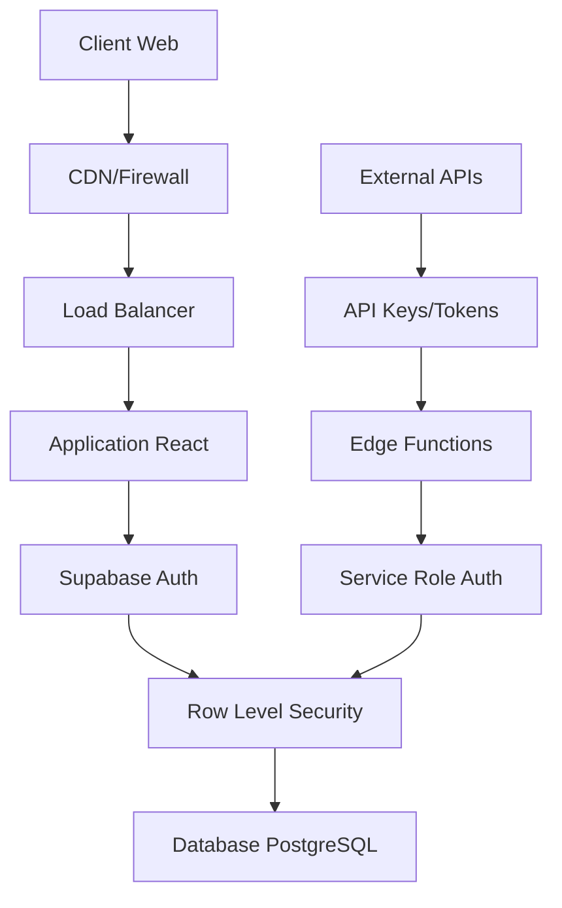
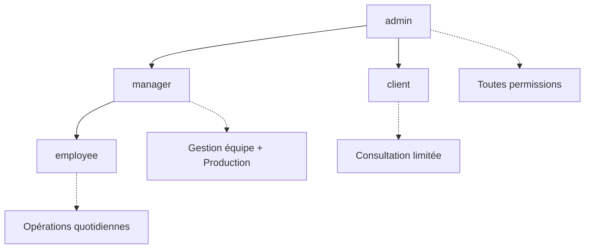
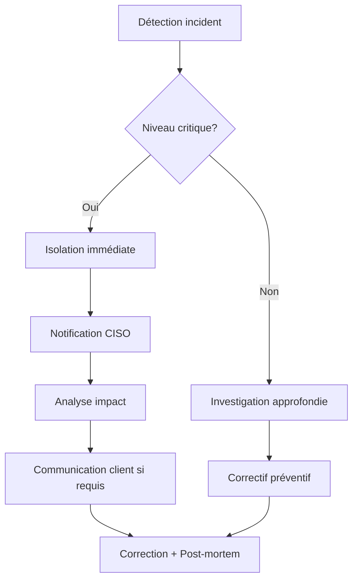

# Sécurité et contrôle d'accès (RBAC) - PromoFlow

## Vue d'ensemble de la sécurité

L'application PromoFlow implémente un système de sécurité multicouche basé sur les principes du **Zero Trust** et du **Role-Based Access Control (RBAC)**, garantissant que chaque utilisateur n'accède qu'aux données et fonctionnalités nécessaires à son rôle.

## 1. Architecture de sécurité

### 1.1 Couches de sécurité



### 1.2 Principes de sécurité appliqués

1. **Authentification forte** : Multi-facteur disponible
2. **Autorisation granulaire** : RLS au niveau ligne
3. **Chiffrement** : En transit (TLS) et au repos
4. **Auditabilité** : Logs complets des actions
5. **Principe du moindre privilège** : Accès minimum nécessaire
6. **Defense in depth** : Validation client ET serveur

## 2. Gestion des utilisateurs et rôles

### 2.1 Hiérarchie des rôles



### 2.2 Définition des rôles

#### Admin (Administrateur système)
```sql
-- Permissions complètes
GRANT ALL ON ALL TABLES IN SCHEMA public TO admin_role;
```

**Capacités:**
- ✅ Gestion complète des utilisateurs
- ✅ Configuration système
- ✅ Accès aux logs et métriques
- ✅ Gestion des fournisseurs
- ✅ Administration base de données
- ✅ Backup et restauration

**Restrictions:**
- ❌ Aucune (rôle super-admin)

#### Manager (Gestionnaire)
**Capacités:**
- ✅ Création/modification employés
- ✅ Validation devis > seuil
- ✅ Accès dashboard analytique
- ✅ Gestion clients stratégiques
- ✅ Pilotage production
- ✅ Export données métier

**Restrictions:**
- ❌ Configuration système
- ❌ Gestion autres managers
- ❌ Accès logs techniques

#### Employee (Employé)
**Capacités:**
- ✅ Création devis clients
- ✅ Gestion BAT/production
- ✅ Communication clients
- ✅ Suivi commandes
- ✅ Mise à jour statuts

**Restrictions:**
- ❌ Validation devis élevés
- ❌ Gestion utilisateurs
- ❌ Configuration produits
- ❌ Accès données financières

#### Client (Client externe)
**Capacités:**
- ✅ Consultation ses devis
- ✅ Validation/rejet commandes
- ✅ Commentaires sur BAT
- ✅ Suivi statut ses commandes

**Restrictions:**
- ❌ Accès données autres clients
- ❌ Interface administration
- ❌ Création directe commandes

### 2.3 Matrice de permissions détaillée

| Ressource | Admin | Manager | Employee | Client |
|-----------|--------|---------|----------|---------|
| **Utilisateurs** |
| Créer admin | ✅ | ❌ | ❌ | ❌ |
| Créer manager | ✅ | ❌ | ❌ | ❌ |
| Créer employee | ✅ | ✅ | ❌ | ❌ |
| Modifier profils | ✅ | 👥 | 🔒 | 🔒 |
| **Clients** |
| Créer client | ✅ | ✅ | ✅ | ❌ |
| Modifier client | ✅ | ✅ | 👤 | ❌ |
| Supprimer client | ✅ | ✅ | ❌ | ❌ |
| Voir tous clients | ✅ | ✅ | ❌ | ❌ |
| **Soumissions** |
| Créer soumission | ✅ | ✅ | ✅ | ❌ |
| Modifier soumission | ✅ | ✅ | 👤 | ❌ |
| Valider > seuil | ✅ | ✅ | ❌ | ❌ |
| Voir toutes | ✅ | ✅ | 👤 | 🔒 |
| **Production** |
| Gérer commandes | ✅ | ✅ | ✅ | ❌ |
| Créer BAT | ✅ | ✅ | ✅ | ❌ |
| Valider qualité | ✅ | ✅ | 👥 | ❌ |
| **Système** |
| Configuration | ✅ | ❌ | ❌ | ❌ |
| Logs systèmes | ✅ | 📊 | ❌ | ❌ |
| Backup/Restore | ✅ | ❌ | ❌ | ❌ |

**Légende:**
- ✅ Accès complet
- ❌ Aucun accès  
- 👤 Ses propres données seulement
- 👥 Équipe sous sa responsabilité
- 🔒 Données liées à son profil
- 📊 Vue read-only/dashboards

## 3. Row Level Security (RLS)

### 3.1 Implémentation RLS par table

#### Table `profiles`
```sql
-- Admin: Accès complet
CREATE POLICY "admin_profiles_full_access" ON profiles
FOR ALL TO authenticated
USING (
  EXISTS (
    SELECT 1 FROM profiles p 
    WHERE p.id = auth.uid() 
    AND p.role = 'admin'
  )
);

-- Manager: Accès équipe + lecture autres
CREATE POLICY "manager_profiles_access" ON profiles  
FOR SELECT TO authenticated
USING (
  EXISTS (
    SELECT 1 FROM profiles p 
    WHERE p.id = auth.uid() 
    AND p.role IN ('admin', 'manager')
  )
);

-- Employee: Lecture limitée, modification profil perso
CREATE POLICY "employee_own_profile" ON profiles
FOR UPDATE TO authenticated  
USING (id = auth.uid());
```

#### Table `clients`
```sql
-- Visibilité selon rôle et propriété
CREATE POLICY "clients_access_by_role" ON clients
FOR SELECT TO authenticated
USING (
  CASE 
    WHEN EXISTS (SELECT 1 FROM profiles WHERE id = auth.uid() AND role IN ('admin', 'manager'))
    THEN true
    WHEN EXISTS (SELECT 1 FROM profiles WHERE id = auth.uid() AND role = 'employee')
    THEN created_by = auth.uid() OR id IN (
      SELECT DISTINCT client_id FROM submissions WHERE created_by = auth.uid()
    )
    ELSE false
  END
);
```

#### Table `submissions`
```sql
-- Accès granulaire selon rôle
CREATE POLICY "submissions_access_control" ON submissions
FOR SELECT TO authenticated
USING (
  -- Admin/Manager: tout voir
  EXISTS (SELECT 1 FROM profiles WHERE id = auth.uid() AND role IN ('admin', 'manager'))
  OR
  -- Employee: ses créations + ses assignations
  created_by = auth.uid()
  OR
  -- Client: ses soumissions via token public (géré séparément)
  false
);
```

#### Table `proofs` (Cas spécial)
```sql
-- Accès authentifié normal
CREATE POLICY "proofs_authenticated_access" ON proofs
FOR SELECT TO authenticated
USING (true);

-- Accès public via token (pour validation client)
CREATE POLICY "proofs_public_token_access" ON proofs  
FOR SELECT TO anon
USING (
  approval_token IS NOT NULL 
  AND expires_at > now()
);
```

### 3.2 Sécurité des Edge Functions

```typescript
// Exemple: Vérification rôle dans Edge Function
async function checkUserRole(userId: string, requiredRole: string[]): Promise<boolean> {
  const { data: profile } = await supabase
    .from('profiles')
    .select('role')
    .eq('id', userId)
    .single();
    
  return requiredRole.includes(profile?.role);
}

// Utilisation dans handler
export async function handler(request: Request) {
  const token = request.headers.get('Authorization')?.replace('Bearer ', '');
  const { data: { user } } = await supabase.auth.getUser(token);
  
  // Vérification rôle requis
  if (!await checkUserRole(user.id, ['admin', 'manager'])) {
    return new Response('Forbidden', { status: 403 });
  }
  
  // Traitement autorisé...
}
```

## 4. Authentification et sessions

### 4.1 Configuration Supabase Auth

```typescript
// Configuration client
const supabase = createClient(
  'https://ytcrplsistsxfaxkfqqp.supabase.co',
  'anon_key',
  {
    auth: {
      persistSession: true,
      autoRefreshToken: true,
      detectSessionInUrl: true,
      flowType: 'pkce' // Plus sécurisé
    }
  }
);
```

### 4.2 Gestion des sessions

**Durée de session:**
- Token d'accès: 1 heure
- Refresh token: 30 jours  
- Session inactivité: 24 heures

**Renouvellement automatique:**
```typescript
// Hook personnalisé pour gérer l'auth
export function useAuth() {
  useEffect(() => {
    // Écoute changements session
    const { data: { subscription } } = supabase.auth.onAuthStateChange(
      (event, session) => {
        if (event === 'SIGNED_OUT' || !session) {
          // Nettoyage données sensibles
          clearClientCache();
          navigate('/login');
        }
      }
    );
    
    return () => subscription.unsubscribe();
  }, []);
}
```

### 4.3 Protection des routes

```typescript
// ProtectedRoute component
function ProtectedRoute({ children, requiredRole }: ProtectedRouteProps) {
  const { user, profile, loading } = useAuth();
  
  if (loading) return <LoadingSpinner />;
  
  if (!user) {
    return <Navigate to="/login" replace />;
  }
  
  if (requiredRole && !requiredRole.includes(profile?.role)) {
    return <AccessDenied />;
  }
  
  return <>{children}</>;
}
```

## 5. Sécurité des données

### 5.1 Chiffrement

**En transit:**
- TLS 1.3 pour toutes communications
- HTTPS forcé (HSTS activé)
- Certificats SSL automatiques

**Au repos:**
- Chiffrement AES-256 base de données
- Stockage fichiers chiffré
- Clés rotées automatiquement

**Côté client:**
- Stockage local minimal
- Pas de données sensibles en localStorage
- Session tokens en httpOnly cookies

### 5.2 Validation et sanitization

```typescript
// Schémas Zod pour validation
const SubmissionSchema = z.object({
  title: z.string().min(3).max(200),
  description: z.string().optional(),
  client_id: z.string().uuid(),
  expected_delivery: z.date().min(new Date()),
  // Validation métier
  total_amount: z.number().positive().max(100000)
});

// Sanitization automatique
function sanitizeInput(input: string): string {
  return input
    .trim()
    .replace(/<script\b[^<]*(?:(?!<\/script>)<[^<]*)*<\/script>/gi, '')
    .replace(/javascript:/gi, '')
    .substring(0, 1000); // Limite longueur
}
```

### 5.3 Protection CSRF

```typescript
// Tokens CSRF pour formulaires critiques
const CSRFToken = () => {
  const [token, setToken] = useState<string>();
  
  useEffect(() => {
    // Génération token côté client
    setToken(crypto.randomUUID());
  }, []);
  
  return <input type="hidden" name="_csrf" value={token} />;
};
```

## 6. Audit et monitoring

### 6.1 Logs de sécurité

```sql
-- Table audit automatique
CREATE TABLE security_logs (
  id UUID DEFAULT gen_random_uuid() PRIMARY KEY,
  user_id UUID REFERENCES auth.users(id),
  action TEXT NOT NULL,
  resource TEXT,
  ip_address INET,
  user_agent TEXT,
  success BOOLEAN DEFAULT true,
  error_message TEXT,
  created_at TIMESTAMP DEFAULT now()
);

-- Trigger automatique sur actions sensibles
CREATE OR REPLACE FUNCTION log_security_event()
RETURNS TRIGGER AS $$
BEGIN
  INSERT INTO security_logs (user_id, action, resource, success)
  VALUES (auth.uid(), TG_OP, TG_TABLE_NAME, true);
  RETURN NEW;
END;
$$ LANGUAGE plpgsql;
```

### 6.2 Alertes de sécurité

**Déclencheurs d'alerte:**
- Tentatives connexion multiples échouées
- Accès données client par utilisateur non autorisé
- Modification massive de données
- Accès à des endpoints non autorisés
- Téléchargement massif de données

**Actions automatiques:**
- Blocage temporaire IP
- Notification admin immédiate
- Révocation session suspecte
- Audit approfondi déclenché

### 6.3 Métriques de sécurité

| Métrique | Seuil | Action |
|----------|--------|--------|
| Échecs connexion/heure | > 20 | Alerte + blocage IP |
| Requêtes/minute/utilisateur | > 100 | Rate limiting |
| Accès données non autorisées | > 1 | Investigation immédiate |
| Modifications admin | Toute | Log + notification |
| Durée session anormale | > 12h | Vérification automatique |

## 7. Conformité et réglementation

### 7.1 RGPD/GDPR

**Droits utilisateurs implémentés:**
- ✅ Droit d'accès (export données personnelles)
- ✅ Droit de rectification (modification profil)
- ✅ Droit à l'effacement ("droit à l'oubli")
- ✅ Portabilité des données (export JSON)
- ✅ Consentement explicite (cookies, newsletters)

```typescript
// Fonction anonymisation RGPD
async function anonymizeUserData(userId: string) {
  await supabase.rpc('anonymize_user', {
    user_id: userId,
    // Conserve données métier, anonymise données perso
    keep_business_data: true
  });
}
```

### 7.2 Politique de rétention

| Type de donnée | Durée conservation | Action après |
|----------------|-------------------|---------------|
| Logs connexion | 1 an | Archivage sécurisé |
| Données clients | 7 ans (légal) | Anonymisation |
| Fichiers BAT | 3 ans | Suppression |
| Logs audit | 5 ans | Archivage froid |
| Sessions actives | 30 jours | Nettoyage auto |

## 8. Plan de réponse incident

### 8.1 Classification des incidents

**Niveau 1 - Critique:**
- Compromission données clients
- Accès non autorisé admin
- Faille sécurité exploitée

**Niveau 2 - Important:**  
- Tentatives intrusion répétées
- Dysfonctionnement authentification
- Fuite données non sensibles

**Niveau 3 - Mineur:**
- Tentatives accès isolées  
- Erreurs configuration mineures
- Alertes préventives

### 8.2 Procédure de réponse



## 9. Roadmap sécurité

### Phase 1 (Immédiat)
- ✅ Audit de sécurité complet effectué
- 🔄 Renforcement RLS policies
- 📋 Tests penetration externes

### Phase 2 (3 mois)
- 📋 Implémentation MFA obligatoire
- 📋 Chiffrement bout-en-bout fichiers
- 📋 SOC/SIEM integration

### Phase 3 (6 mois)
- 📋 Certification ISO 27001
- 📋 Zero Trust architecture complète
- 📋 IA détection anomalies

**Légende:**
- ✅ Implémenté
- 🔄 En cours
- 📋 Planifié