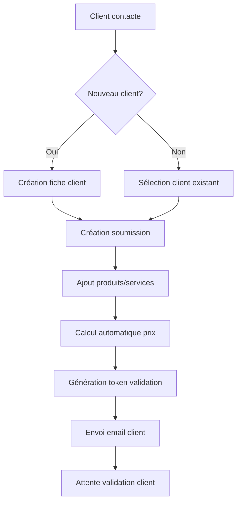
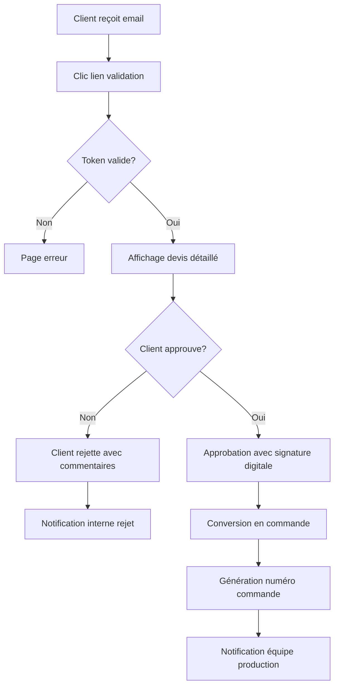
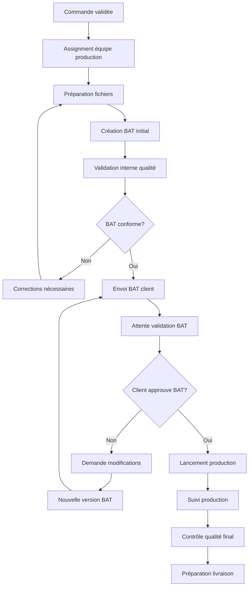
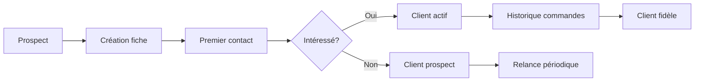
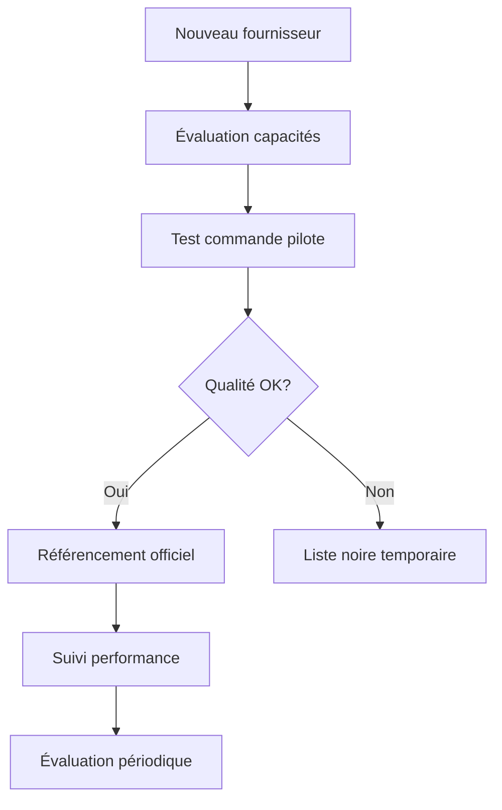
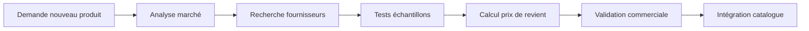
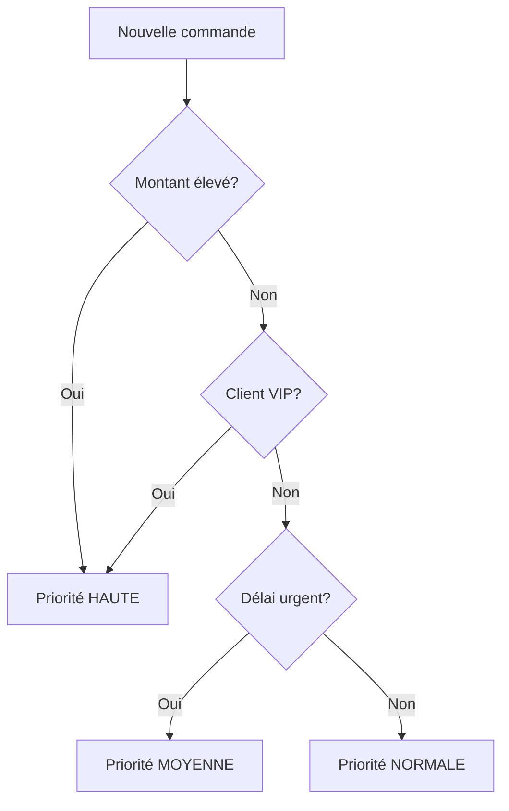
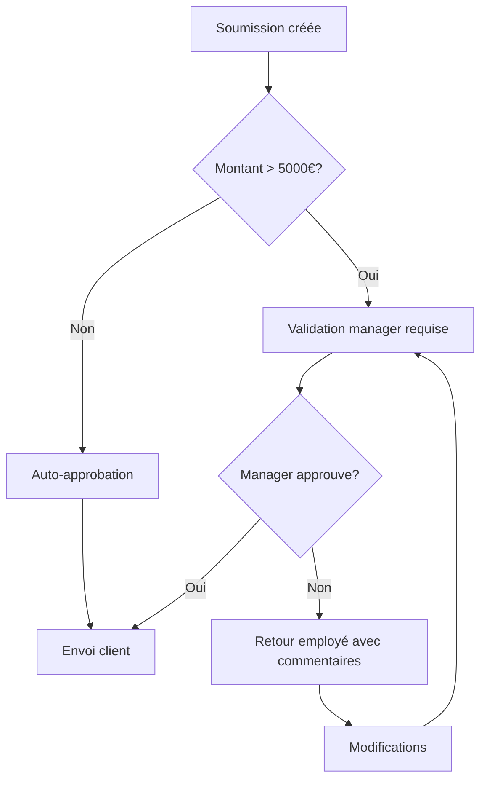
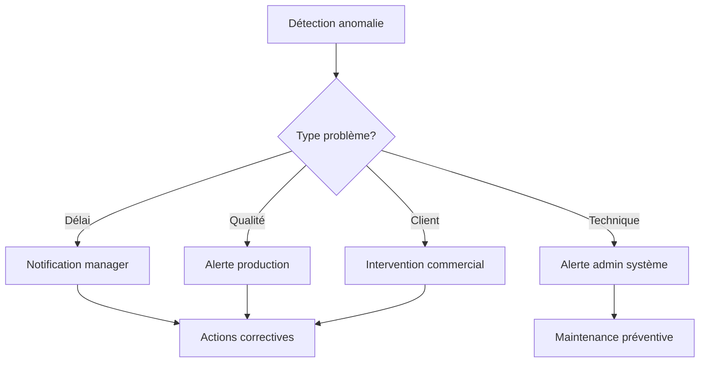

# Workflows métier - PromoFlow

## Vue d'ensemble

Cette documentation détaille tous les processus métier de l'application PromoFlow, de la création d'un devis à la livraison finale, incluant les points de validation et les notifications automatiques.

## 1. Workflow principal : Devis → Production → Livraison

### Phase 1: Création du devis



**Acteurs impliqués:**
- **Employé/Manager**: Création devis
- **Client**: Validation en ligne
- **Système**: Calculs automatiques, notifications

**Actions système:**
1. Génération automatique du numéro de soumission
2. Calcul des totaux avec TVA
3. Création token sécurisé (UUID + expiration)
4. Envoi email avec lien validation
5. Création entrée audit trail

### Phase 2: Validation client



**Points de contrôle:**
- ✅ Validation token (sécurité)
- ✅ Vérification expiration devis
- ✅ Capture signature/approbation client
- ✅ Traçabilité complète des décisions

### Phase 3: Production



**Gestion des BAT (Bon À Tirer):**
- Version automatique (v1, v2, v3...)
- Token sécurisé par BAT
- Historique complet des commentaires
- Expiration automatique (configurable)
- Notifications de rappel

## 2. Workflows secondaires

### 2.1 Gestion des clients



**Statuts client:**
- `prospect` - Premier contact
- `active` - Au moins une commande
- `inactive` - Pas d'activité >6 mois
- `vip` - Client premium (CA élevé)

### 2.2 Gestion des fournisseurs



**Critères d'évaluation:**
- Délais respectés
- Qualité produits
- Réactivité communication
- Compétitivité prix
- Capacité production

### 2.3 Gestion des produits



## 3. Notifications automatiques

### 3.1 Notifications client

| Événement | Déclencheur | Destinataire | Template |
|-----------|-------------|---------------|----------|
| Nouveau devis | Création submission | Client | `submission-notification` |
| Rappel validation | J+3 sans réponse | Client | `reminder-validation` |
| BAT disponible | Upload proof | Client | `proof-notification` |
| Commande prête | Production terminée | Client | `order-ready` |
| Livraison | Expédition | Client | `delivery-confirmation` |

### 3.2 Notifications internes

| Événement | Déclencheur | Destinataire | Action |
|-----------|-------------|---------------|---------|
| Nouveau devis | Création | Manager | Dashboard update |
| Validation client | Approbation | Production | Notification production |
| BAT rejeté | Rejet client | Designer | Corrections nécessaires |
| Délai dépassé | Date limite | Manager | Alerte escalade |
| Erreur système | Exception | Admin | Investigation requise |

### 3.3 Edge Functions de notification

```typescript
// Exemple: send-submission-notification
export async function handler(request: Request) {
  const { submissionId, clientEmail } = await request.json();
  
  // Récupération données soumission
  const submission = await getSubmissionDetails(submissionId);
  
  // Génération du template email
  const emailHtml = await generateSubmissionEmail(submission);
  
  // Envoi email via service externe
  await sendEmail({
    to: clientEmail,
    subject: `Nouveau devis - ${submission.title}`,
    html: emailHtml
  });
  
  // Mise à jour statut
  await updateSubmissionStatus(submissionId, 'pending');
}
```

## 4. Règles métier et validations

### 4.1 Validation des devis

**Règles automatiques:**
- Prix minimum par produit
- Remises maximum autorisées
- Délais de livraison réalistes
- Disponibilité stock fournisseurs

**Validations manuelles:**
- Approbation manager si montant > seuil
- Vérification capacité production
- Validation délais exceptionnels

### 4.2 Gestion des priorités



**Niveaux de priorité:**
- `LOW` - Commande standard
- `MEDIUM` - Client important ou délai serré  
- `HIGH` - Commande critique ou VIP
- `URGENT` - Exception manuelle

### 4.3 Workflow d'approbation



## 5. Indicateurs de performance (KPI)

### 5.1 Métriques temps

- **Temps création devis**: Objectif < 30 minutes
- **Taux validation client**: Objectif > 70%
- **Délai validation BAT**: Objectif < 48h
- **Temps production moyen**: Suivi par type produit

### 5.2 Métriques qualité

- **Taux BAT accepté v1**: Objectif > 80%
- **Nombre révisions moyen**: Objectif < 2
- **Satisfaction client**: Enquête post-livraison
- **Taux réclamation**: Objectif < 5%

### 5.3 Métriques business

- **Taux conversion devis**: Objectif > 60%
- **Panier moyen**: Évolution mensuelle
- **Récurrence client**: Mesure fidélisation
- **Marge brute moyenne**: Optimisation continue

## 6. Gestion des exceptions

### 6.1 Escalade automatique



### 6.2 Processus de réclamation

1. **Réception réclamation** (Email/Téléphone)
2. **Création ticket incident** (Avec priorité)
3. **Investigation cause** (Équipe concernée)
4. **Plan d'action correctif** (Avec délais)
5. **Suivi résolution** (Communication client)
6. **Clôture et feedback** (Satisfaction)

## 7. Intégrations externes

### 7.1 Système comptable
- Export factures automatique
- Synchronisation clients
- Rapports de CA

### 7.2 Logistique
- Tracking transporteurs
- Notifications livraison
- Gestion retours

### 7.3 Fournisseurs
- API catalogue produits
- Commandes automatisées
- Suivi stock temps réel

## 8. Évolutions prévues

### Version 2.0
- Workflow mobile (tablette production)
- Signature électronique intégrée
- Chat client temps réel
- IA prédictive délais

### Version 3.0
- Intégration ERP complet
- Automatisation production (Industrie 4.0)
- Analytics avancées (BI)
- API publique partenaires